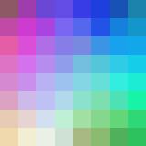
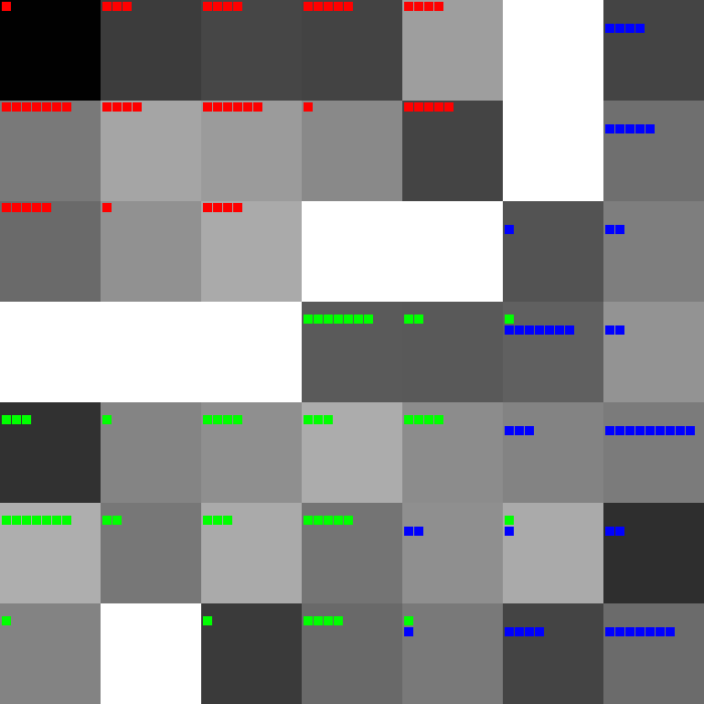
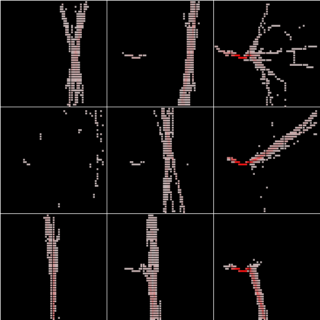
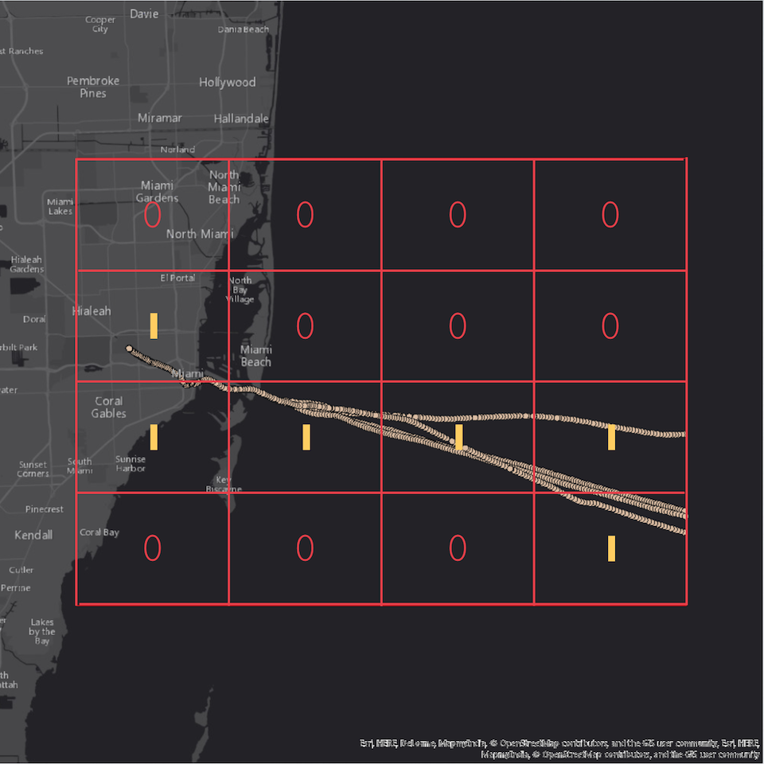

# Self Organizing Maps

Yet another set of [SOM](https://en.wikipedia.org/wiki/Self-organizing_map) implementations.

## Build The Project

```
mvn -P spark-compile clean package
```

## Color App

Organize a set of colors by their HSB values on a 2D grid lattice.

```
java -Djava.awt.headless=true\
 -Xms1g -Xmx32g\
 -classpath target/spark-som-path-0.1-jar-with-dependencies.jar\
 com.esri.ColorApp && open /tmp/som.png
```



## Iris App

Organize [Iris Dataset](https://en.wikipedia.org/wiki/Iris_flower_data_set) on 2D grid Lattice.



This is a 7x7 lattice where the cell background color is proportional to the difference between the cell vector and the average distance of the elements that fit into the cell. The colors range from black to light gray, where black indicates a small difference and light gray indicates a large difference. In addition, each cell is populated with the number of training irises that fall into it in the form of squares. Red squares indicate irises labeled Setosa. Green squares indicate Versicolor and blue squares indicate Virginica.

```
java -Djava.awt.headless=true\
 -Xms1g -Xmx32g\
 -classpath target/spark-som-path-0.1-jar-with-dependencies.jar\
 com.esri.IrisApp && open /tmp/iris.png
```

## Track App

Organize and recognize ship "general" paths in Miami harbor based on [AIS data](https://marinecadastre.gov/ais/).



Given AIS broadcast points, the track assembly and the track quantization is performed using the [PathFinder](https://github.com/mraad/arcgis-alluxio/blob/master/src/main/scala/com/esri/PathFinder.scala) application.The track quantization is based on overlaying a virtual grid on a track.  The track vectorization is based on scanning the grid cells from left to right and top to bottom where the existence of broadcast points in a grid cell translates into a binary value as a vector element. The below track becomes `[0,0,0,0,1,0,0,0,1,1,1,1,0,0,0,1]`



Build the application using:

```
mvn -P spark-provided clean package
```

This application uses [Spark](http://spark.apache.org/) to read and prepare the data for training. The training is still "traditional".

```
spark-submit --driver-memory 32g --executor-memory 32g target/spark-som-path-0.1-jar-with-dependencies.jar
```

### TODO

- ~~Implement ColorApp in Spark~~
- Implement TrackApp in Spark

### References

- https://www.cloudera.com/documentation/enterprise/5-5-x/topics/spark_mllib.html
- https://en.wikipedia.org/wiki/Iris_flower_data_set
- http://www.pymvpa.org/index.html
